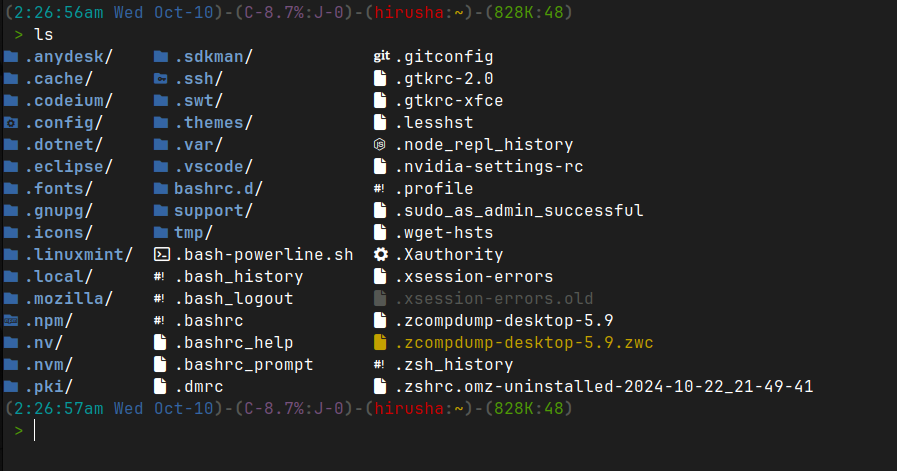

# Extreme Ultimate `.bashrc`

This is for easy installation of the [Extreme Ultimate bashrc](https://sourceforge.net/projects/ultimate-bashrc/) for beginners. Refer to the sourceforge page for more information and documentation. After installation, you can also run `hlp` to view help.



[Click here](#demonstration) to open demonstration media.

## Installation

Install `wget`:

```bash
sudo apt install wget
```

Run the installer:

```bash
wget -q -O install.sh "https://raw.githubusercontent.com/hirusha-adi/Extreme-Ultimate-bashrc/refs/heads/main/install.sh" && chmod +x install.sh && ./install.sh && rm install.sh
```

## Additional Configuration

Switch to [`fastfetch`](https://github.com/fastfetch-cli/fastfetch?tab=readme-ov-file#installation) from `neofetch`. You don't have to remove `neofetch`. The `.bashrc` will choose `fastfetch` over `neofetch`. Or, if you dont want this to run, simply disable it by seetting `_SKIP_SYSTEM_INFO=true`.

```
sudo add-apt-repository ppa:zhangsongcui3371/fastfetch
sudo apt update
sudo apt install fastfetch
```

For colored `ls` command, install `lsd`:

```
sudo apt install lsd
```

You should also have [Nerd Fonts](https://www.nerdfonts.com/font-downloads) installed (prefferably "JetBrainsMono Nerd Font") for the icons to work.

To Install the font, download it, and extract all of the font files (eg: `*.ttf`) to `~/.fonts/`.

## Demonstration

Youtube Video: [Click here](https://youtu.be/sg_FFVTZixU?si=BfU3WwStlxl8k9qn).

<video width="640" height="360" controls>
  <source src="./demo/installation.mp4" type="video/mp4">
  Your browser does not support the video tag.
  Go to the ./demo folder demonstration media.
</video>


